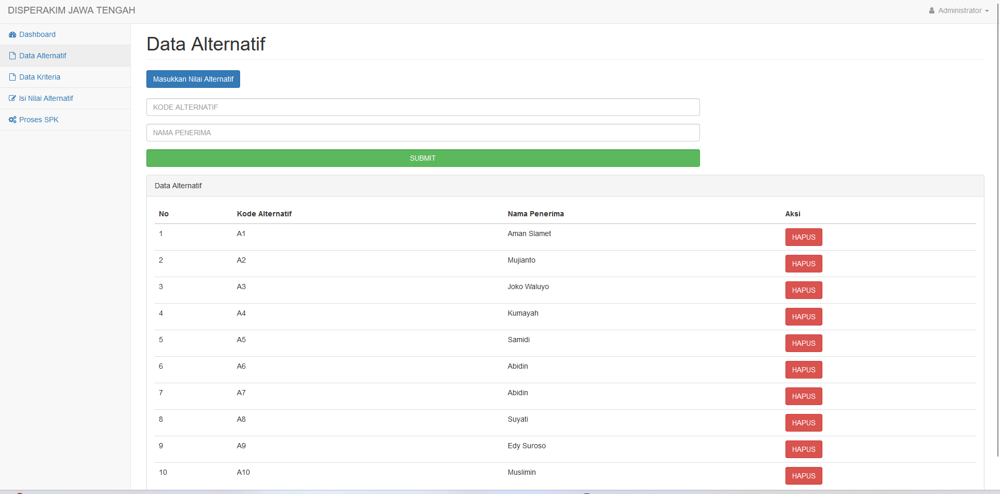
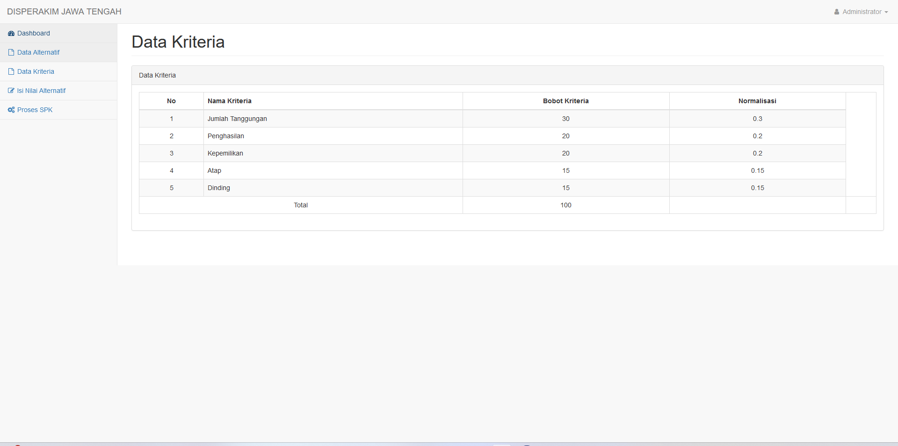
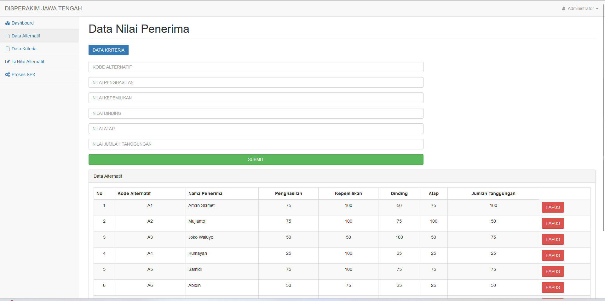
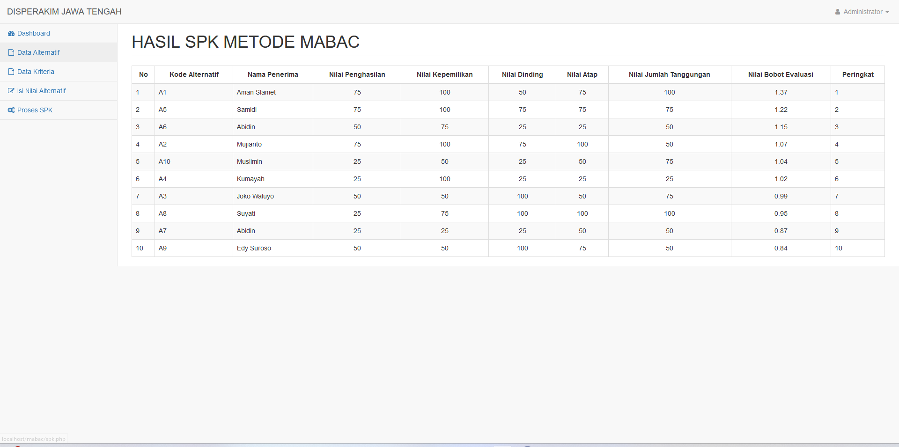

## Sistem Pendukung Keputusan Mabac
- **SPK** : sebuah sistem berbasis komputer dengan antarmuka antara mesin/komputer dan pengguna. SPK ditujukan untuk membantu pembuat keputusan dalam menyelesaikan suatu masalah dalam berbagai level manajemen dan bukan untuk mengganti posisi manusia sebagai pembuat keputusan.
- **Mabac** : Multi-Attributive Border Approximation Area Comparison (MABAC) merupakan salah satu metode sistem pendukung keputusan yang bersifat multikriteria dan dianggap sebagai salah satu metode yang handal dalam pengambilan keputusan rasional.

## Installation
- create new database in MySQL server (phpMyAdmin)
- edit file onek.php
- import db/db_fix.sql into your new database
- run your website

## Screenshot

